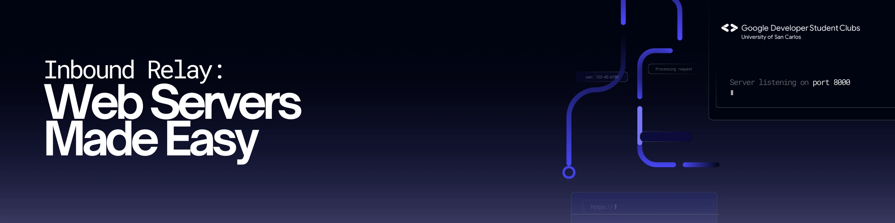

# gdsc-express-workshop

This workshop offers a one-day deep dive into the foundations of backend development, focusing on essential concepts such as server-side scripting, routing, and middleware.

## Topics

1. Background on Node.js

- description
- use cases
- npm
  - libraries

2. Terminologies

- Non-blocking I/O
- Event-driven
  - Event Loop
- Callback Functions
  - Callback Hell
- Promise API

3. HyperText Transfer Protocol (HTTP)

- description
- HTTP Verbs
  - POST
  - GET
  - PUT
  - DELETE
- HTTP Status Codes
  - common status codes

4. Representational State Transfer (REST)

- description
- Resources
- CRUD
- Client-Server Communication

5. Express.js

- description
- use cases

## Project Showcase: Online Post Application Backend

You'll be finishing the frontend I created here by making a backend in any programming language.

### Acceptance Criteria

1. The frontend should communicate with the backend.

- change the `/client/src/services/Post.service.js` to connect to the backend
- do NOT change the general form of the endpoints, they must be RESTful.

2. The app should have CRUD capabilities.

- respond to the `axios` requests in your backend with JSON (if needed).
- use proper HTTP Status Codes.

3. Do not edit the frontend that much.

- this project will teach you to work with the "Separation of Concerns" mindset.
  - you just do the backend work, while the frontend is done by someone else (me).

4. (BONUS) Deploy your application to be shared online.

- you can use GitHub pages to deploy your frontend.
- your backend can be deployed on any Platform-as-a-Service or Cloud Infrastructure.
  - make sure you read up about [CORS](https://developer.mozilla.org/en-US/docs/Web/HTTP/CORS) when your requests don't get processed.

## References

- [http.cat: HTTP Status Codes Explained with Cat Memes](https://developer.mozilla.org/en-US/docs/Web/HTTP/CORS)
- [w3c: the HTTP Spec](https://www.w3.org/Protocols/)
- [Red Hat: What is a REST API?](https://www.redhat.com/en/topics/api/what-is-a-rest-api)
